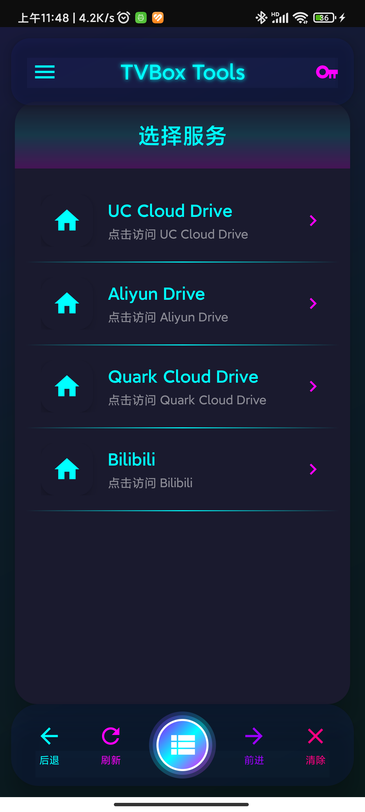

<div align="center">

# TVBox Tools

> 一款专为 TVBox 用户打造的专业级云盘认证工具

[](https://android-arsenal.com/api?level=25)
[](LICENSE)
[](https://www.android.com)

---

**🌐 多平台 · 🔑 一键获取 · 🎨 精美界面**

让 TVBox 配置变得前所未有的简单

---



---</div>

---

## ✨ 核心特性

| 特性 | 描述 |
|:---:|:---|
| 🌐 **多平台支持** | 集成 UC云盘、阿里云盘、夸克网盘、B站等热门平台 |
| 🔑 **一键提取** | 自动识别并提取 Cookie 或 Token 信息 |
| 🎨 **赛博风格** | 精致的霓虹光效与流畅动画交互 |
| 📱 **优雅导航** | 直观的底部导航栏，操作如丝般顺滑 |
| 🔄 **无缝切换** | 点击即跳转，无需复杂配置 |
| 📋 **自动复制** | 认证信息自动复制到剪贴板 |

---

## 🎯 支持的服务

| 服务 | 认证方式 | 说明 |
|:---|:---|:---|
| **UC云盘** | Cookie (`__pus`) | 提取 `__pus` Cookie 值 |
| **阿里云盘** | JavaScript Token | 从 `localStorage` 提取 `refresh_token` |
| **夸克网盘** | Cookie (`__pus`) | 提取 `__pus` Cookie 值 |
| **Bilibili** | Cookie (`SESSDATA`) | 提取 `SESSDATA` Cookie 值 |

---

## 📖 快速开始

### 安装应用

1. 从 [Releases](../../releases) 下载最新 APK
2. 在设备上启用「允许未知来源」安装
3. 安装并打开应用

### 使用流程

```
┌─────────────┐    ┌─────────────┐    ┌─────────────┐
│  打开应用    │ -> │ 选择服务    │ -> │  登录账号    │
└─────────────┘    └─────────────┘    └─────────────┘
       ↓                 ↓                 ↓
┌─────────────┐    ┌─────────────┐    ┌─────────────┐
│  加载默认    │ -> │  访问网站    │ -> │  获取认证    │
│  夸克网盘    │    │  网页登录    │ -> │  信息复制    │
└─────────────┘    └─────────────┘    └─────────────┘
```

### 导航说明

| 按钮 | 功能 |
|:---:|:---|
| ⬅️ | 返回上一页 |
| ➡️ | 前进到下一页 |
| 🔄 | 刷新当前页面 |
| 🧹 | 清除 Cookie 和 LocalStorage（需确认） |
| ☰ | 显示/隐藏服务列表面板 |

---

## 🛠️ 自定义服务

编辑 `app/src/main/assets/services.json` 添加或修改服务：

```json
[
  {
    "服务名称": {
      "url": "https://example.com",
      "cookie": "cookie_key",
      "js": "JavaScript代码"
    }
  }
]
```

**配置说明：**

| 参数 | 必填 | 说明 |
|:---|:---:|:---|
| `url` | ✅ | 服务网站的完整地址 |
| `cookie` | ❌ | 需要提取的 Cookie 键名 |
| `js` | ❌ | 用于提取 Token 的 JavaScript 代码 |

> 💡 `cookie` 和 `js` 二选一即可

---

## 🏗️ 技术架构

### 技术栈

```
┌─────────────────────────────────────────┐
│           Presentation Layer            │
│  Material Design · WebView · Animations  │
└─────────────────┬───────────────────────┘
                  │
┌─────────────────▼───────────────────────┐
│           Business Logic                 │
│  Cookie Parsing · Token Extraction      │
└─────────────────┬───────────────────────┘
                  │
┌─────────────────▼───────────────────────┐
│              Data Layer                  │
│  Services JSON · SharedPreferences       │
└─────────────────────────────────────────┘
```

| 技术 | 版本 |
|:---|:---:|
| 语言 | Java |
| 最低 SDK | Android 7.0 (API 25) |
| 目标 SDK | Android 15 (API 35) |
| Gradle | 8.12.0 |
| JDK | 1.8 |

### 项目结构

```
TVBox-Tools/
├── app/
│   ├── src/
│   │   └── main/
│   │       ├── java/anyang/tvbox/tools/
│   │       │   ├── MainActivity.java          # 主 Activity
│   │       │   └── ServiceListAdapter.java    # 服务列表适配器
│   │       ├── res/
│   │       │   ├── layout/                    # 布局文件
│   │       │   ├── drawable/                  # 图标与背景资源
│   │       │   └── values/                    # 字符串与颜色资源
│   │       └── assets/
│   │           └── services.json             # 服务配置文件
│   └── build.gradle.kts
├── gradle/
├── build.gradle.kts
└── settings.gradle.kts
```

---

## 🚀 构建指南

### 方式一：Android Studio

```bash
1. 克隆仓库
   git clone https://github.com/yourusername/TVBox-Tools.git

2. 用 Android Studio 打开项目

3. 等待 Gradle 同步完成

4. 连接设备或启动模拟器

5. 点击 Run 按钮（或按 Shift + F10）
```

### 方式二：命令行

```bash
# 构建版本
./gradlew assembleDebug          # Debug 版本
./gradlew assembleRelease         # Release 版本

# 安装到设备
adb install app/build/outputs/apk/release/app-release.apk

# Release 版本会自动复制到桌面 AppOutputs 文件夹
```

---

## 🎨 界面展示

**设计亮点：**

- 🌟 **毛玻璃效果** 的顶部标题栏
- 💎 **霓虹发光** 的 WebView 容器
- 🌙 **弧形设计** 的底部导航栏
- 🎭 **中央悬浮** 的服务切换按钮
- ✨ **流畅动画** 的交互体验

---

## 📝 版本历史

|      版本       |     日期     | 更新内容 |
|:-------------:|:----------:|:---|
| **v20260208** | 2026-02-08 | 全新 UI 改版 · 赛博朋克风格 · 修复列表点击问题 |

---

## ⚖️ 免责声明

- 本项目仅供学习和个人使用
- 请遵守各平台的服务条款，合理使用认证信息
- 不要将获取的认证信息泄露给他人
- 本应用与各云盘平台无官方关联

---

## 📄 许可证

MIT License - 详见 [LICENSE](LICENSE)

---

<div align="center">

**如果觉得有用，请给个 ⭐ Star 支持**

Made with ❤️ by Stephen

</div>
